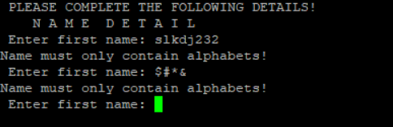
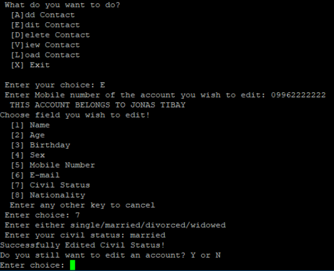
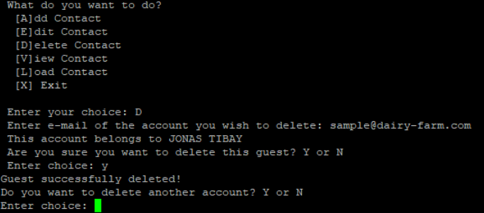
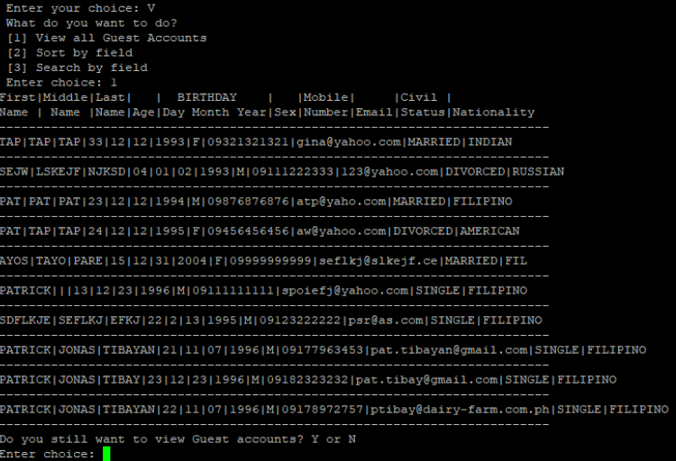
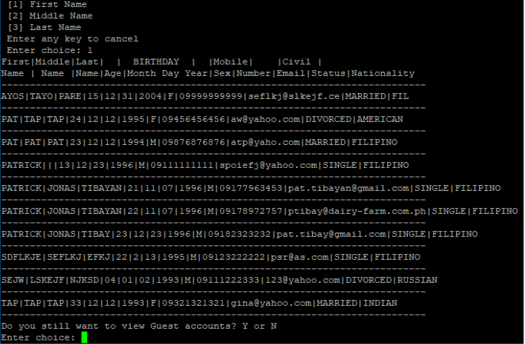
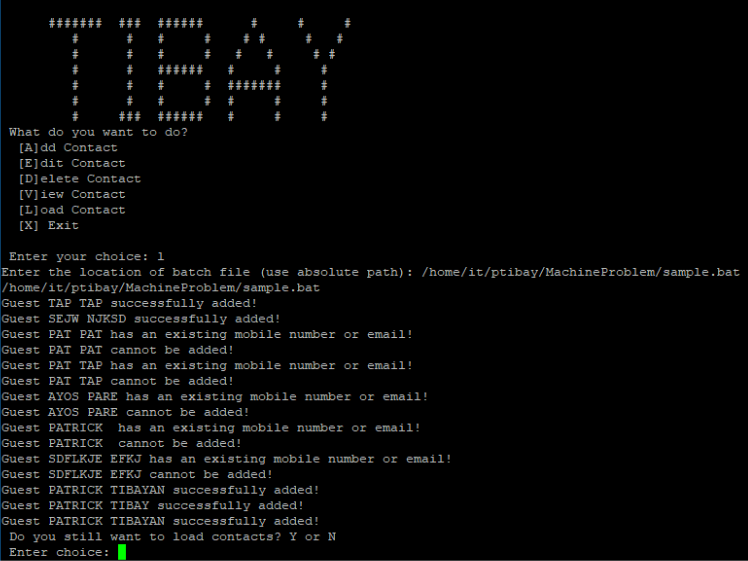

# BASH SCRIPT: USER MANAGEMENT PROJECT

User management project is a system that can add, edit, delete, view, and load contact, where all of the data will be stored on a text file, and the logs to every actions will be saved.

 

## **SCRIPT SCREENSHOTS**
#
## Home Page

## Add Contact

## Sample Error-Handling

## Edit Contact

## Delete Contact

## View Contact

## Sort Contact

## Search via Keyword

## Load Contact
